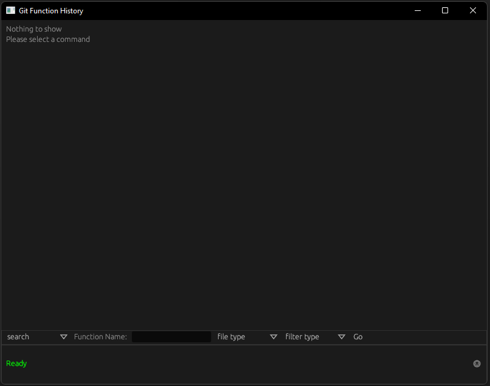
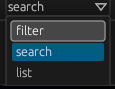
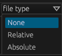
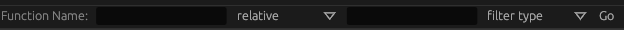
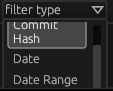

# [](https://crates.io/crates/git-function-history-gui) [](https://crates.io/crates/git-function-history-gui)

# git function history GUI

A GUI frontend for the [git function history library](https://crates.io/crates/git_function_history).

## Usage

When you run the program, you will see a window, like this: (the title bar/decorations vary by platform)



The app is split into three sections:

- The top section shows the current output of whatever command you have entered in the command bar, this section is called the viewing pane.

- The middle section is where you build and run commands, it is called the command bar.

- The bottom section shows the current status of the app, and any errors that have occurred, and on the right hand side there is as a button to change the theme.

### Command bar


Even though the command bar is the middle section, we will start with it because you cannot use the top section without first building a command in the command bar.

The leftmost part of the command bar is the command selector, it is a drop down menu that allows you to select the command you want to build.



The commands are:

- `filter`: This command allows you to filter the output of the previous command.

- `search`: This command builds a search query for a function in a git repository.

- `list`: This command is used to list commit hashes or dates for each commit in a git repository.

#### Command bar - search


The first thing you'll see is a text box, this is where you enter the name of the function you want to search for.

The next thing you'll see is a drop down menu, this is the search file selector, it allows you to select what type of file you want to search in.



The options are:

- `None`: This option will search all rust files in the repository (very expensive).

- `relative`: This will search all file ending with the filename specified in the text box.

- `absolute`: This option will search the exact file specified in the text box.

If you select `relative` or `absolute` then you will see a text box appear, this is where you enter the filename.



After that there is another dropdown menu to filter the search (before it is run) to save time.



The options are:

- `None`: This option will not filter the search.

- `commit hash`: This option will filter the search to only the commit with the commit hash specified in the text box.

- `date`: This option will filter the search to only the commit closest to the date specified in the text box.

`Date Range`: This option will filter the search to only the commits between the two dates specified in the text boxes.

If you select `Commit Hash` or `Date` then you will see a text box appear, this is where you enter the commit hash or date, with `Date Range` you will see two text boxes appear, these are where you enter the start and end dates.


After that there is `Go` button, this will run the command and display the output in the viewing pane (after the command has finished).


#### Command bar - filter

## Known issues

- [windows]: App crashes with ```error: process didn't exit successfully: `target\debug\git-function-history-gui.exe` (exit code: 0xc0000374, STATUS_HEAP_CORRUPTION)```, This is an issue with the underlying GUI library being used it might vary depending on the hardware you use.
